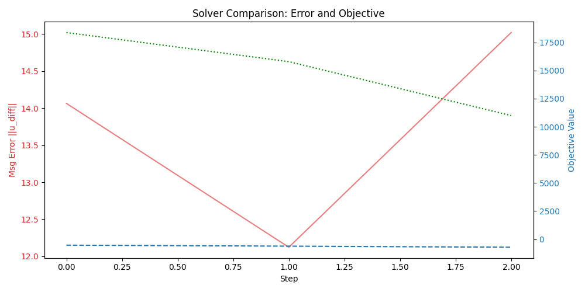
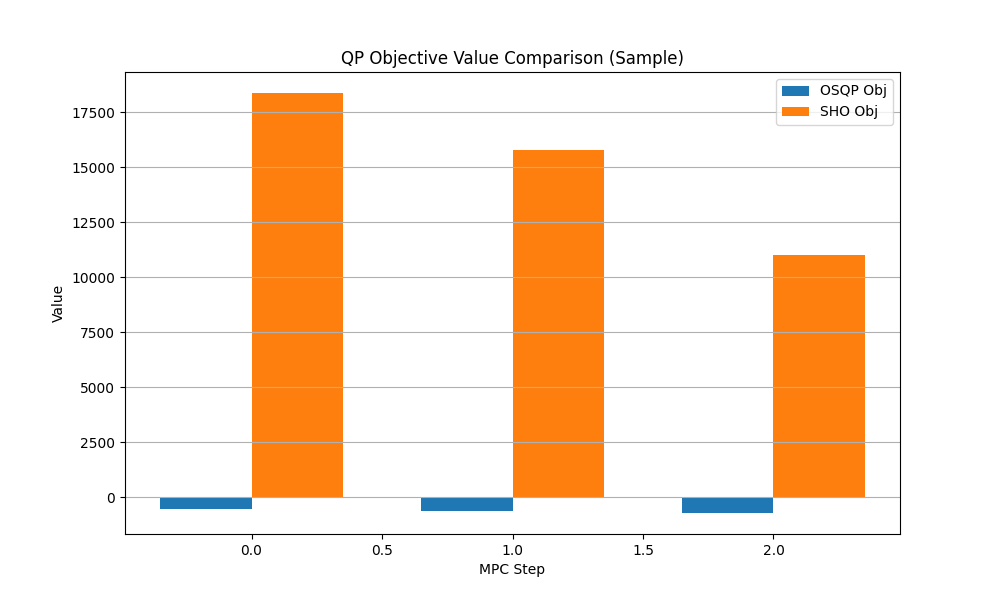
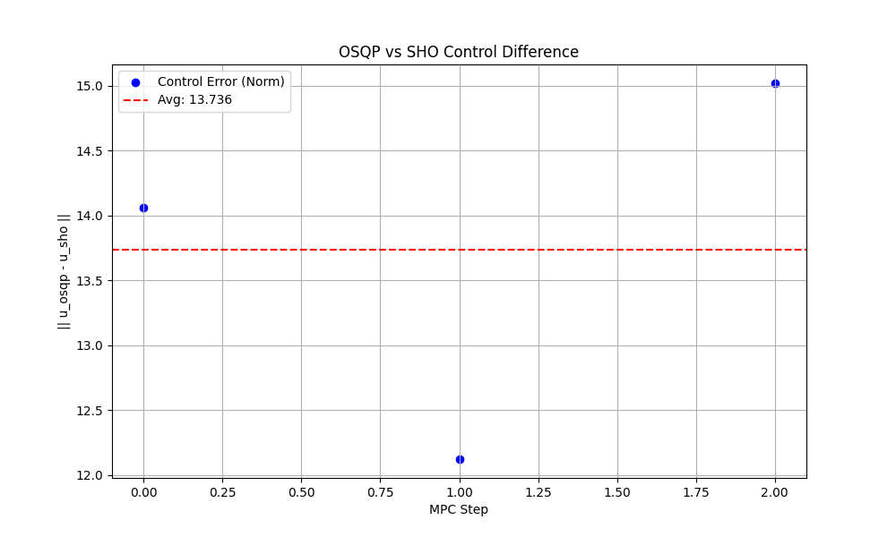
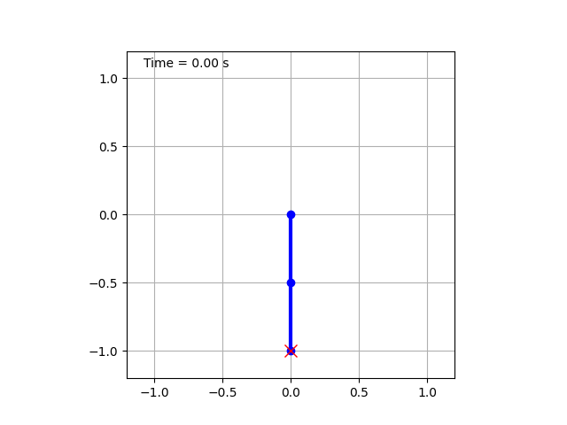

# Neuromorphic MPC Test Report
**Date:** 2026-02-03 21:01:38
**Dataset:** `data/results`

## 1. Performance Summary
- **Total Steps:** 3
- **Avg Control Error (Norm):** 13.7355
- **Avg OSQP Cost:** -622.5288
- **Avg SHO Cost:** 15054.2161

### Control Error & Cost Comparison

### Detailed Comparisons

## 2. Configuration
- **Dynamics**: 2-DOF Arm (CasADi)
- **Solvers**: OSQP (Reference) vs SHO (Ising Machine)

## 3. Visualization
