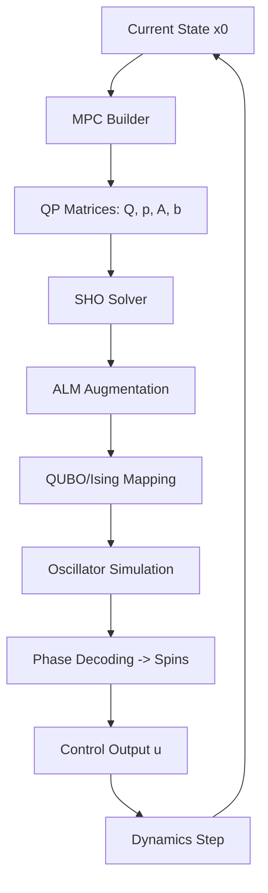

# Comprehensive Guide: Theory, Code, and Validation

This document provides a deep-dive into the Neuromorphic Robot Control system, explaining the connection between formal derivation and implementation.

## 1. Mathematical Foundation to Code Mapping

### 1.1 2-DOF Arm Dynamics
**Theory**: The dynamics are defined by $M(\theta)\ddot{\theta} + C(\theta, \dot{\theta})\dot{\theta} + G(\theta) = \tau$.
**Implementation** ([arm2dof.py](file:///Users/alvin/Documents/Alvin/College/Academics/Master's Thesis/Code/Neuromorphic-Robot-Control/src/dynamics/arm2dof.py)):
- `_setup_dynamics()`: Uses CasADi symbolic variables to define the Inertia matrix $M$ (lines 34-42), Coriolis matrix $C$ (lines 44-54), and Gravity vector $G$ (lines 56-60). 
- **Auto-differentiation**: `A_fun` and `B_fun` (lines 71-72) compute the Jacobians $\frac{\partial f}{\partial x}$ and $\frac{\partial f}{\partial u}$, essential for the linearized MPC.

### 1.2 MPC QP Construction
**Theory**: Minimize $\sum (x-x_{ref})^T Q_x (x-x_{ref}) + u^T R u$ subject to $x_{k+1} = Ax_k + Bu_k + c$.
**Implementation** ([qp_builder.py](file:///Users/alvin/Documents/Alvin/College/Academics/Master's Thesis/Code/Neuromorphic-Robot-Control/src/mpc/qp_builder.py)):
- `build_qp()`: Constructs the large sparse $Q$ and $p$ matrices.
- **Linearization**: (lines 107-114) performs the discretization of the continuous dynamics at each time step to create the equality constraints $A_{eq}z = b_{eq}$.

### 1.3 SHO Solver (The Neuromorphic Core)
**Theory**: Mapping an optimization problem to a physical system of coupled oscillators.
**Implementation** ([sho_solver.py](file:///Users/alvin/Documents/Alvin/College/Academics/Master's Thesis/Code/Neuromorphic-Robot-Control/src/solver/sho_solver.py)):
1. **ALM Loop**: `solve()` (lines 45-80) manages the Augmented Lagrangian iterations.
2. **Binary Encoding**: `_continuous_to_qubo()` (lines 82-108) converts continuous variables $z$ into binary spins $s$ using bit-scaling.
3. **Ising Mapping**: `_qubo_to_ising()` (lines 110-123) transforms the QUBO into an Ising Hamiltonian (couplings $J$ and fields $h$).
4. **Physical Dynamics**: `_oscillator_dynamics()` (lines 147-152) simulates the phase synchronization:
   $$\dot{\phi}_i = \omega_i + K \sum J_{ij} \sin(\phi_j - \phi_i) + h_i$$

## 2. Data Flow and Interconnectivity

The system operates as a pipeline:


### Data Inspection
All intermediate data is saved in `results/mpc_test_data.npz`. You can open it in Python:
```python
import numpy as np
data = np.load('results/mpc_test_data.npz')
print(data.files) # ['Q', 'p', 'A_eq', 'b_eq', 'A_ineq', 'k_ineq', 'z_osqp', 'z_sho']
```

## 3. Verification & Validation Protocol

To manually confirm the math and physics are correct:
1. **Coupling Symmetry**: Verify `J = J.T` and `diag(J) = 0`. This ensures the energy landscape is stable.
2. **h-field Magnitude**: Check that `h` scales correctly with the linear term $p$. If $h$ is too large, the oscillators "lock" to the field rather than the couplings, ignoring constraints.
3. **Phase-Locking**: In `_solve_ising_oscillator`, the final phases $\phi$ should be close to $0$ or $\pi$. This indicates the system reached a stable spin state.

## 4. Final Project Structure
- `src/`: Source code.
  - `dynamics/`: Robot physics.
  - `mpc/`: QP generation logic.
  - `solver/`: OSQP (baseline) and SHO (neuromorphic) solvers.
- `tests/`: Verification scripts.
- `results/`: Saved data and traces for analysis.
- `docs/`: Theory and explanation files.
